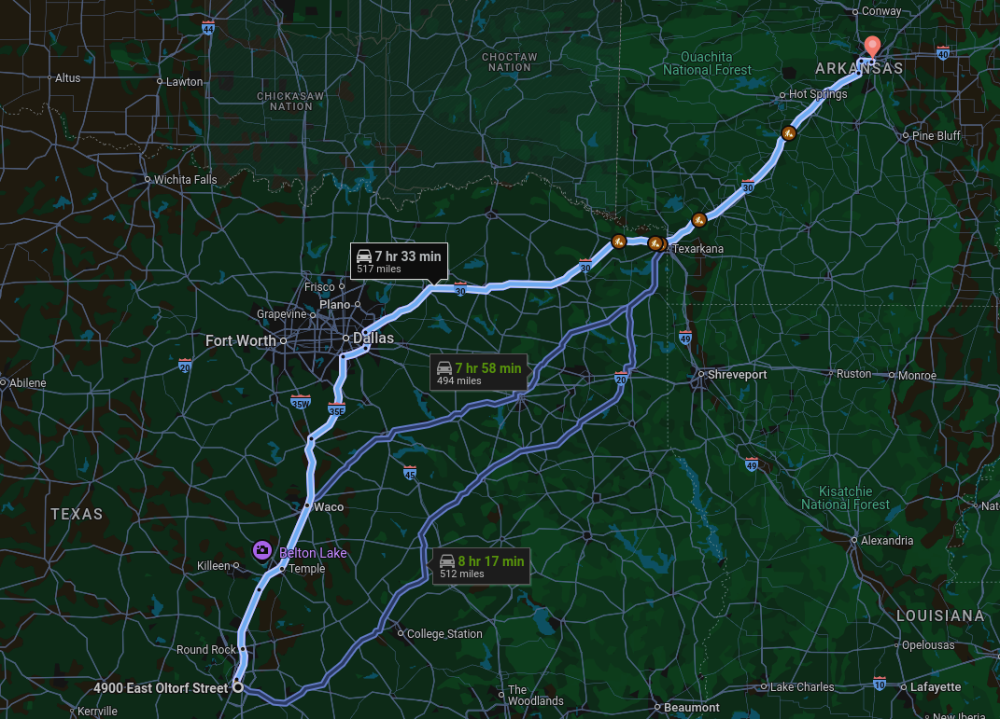
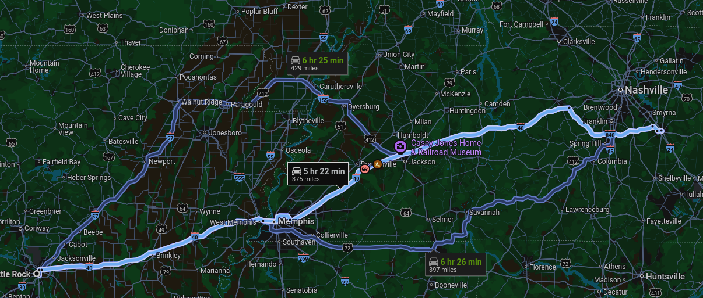
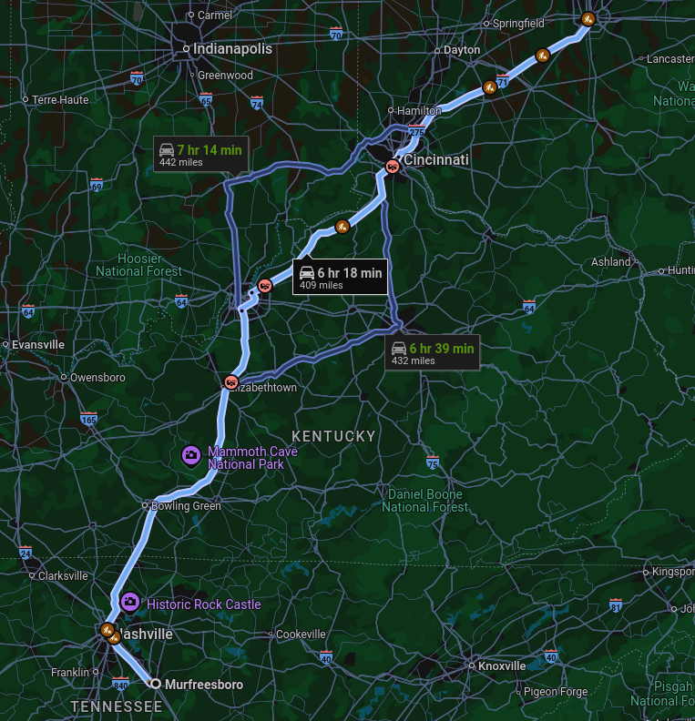
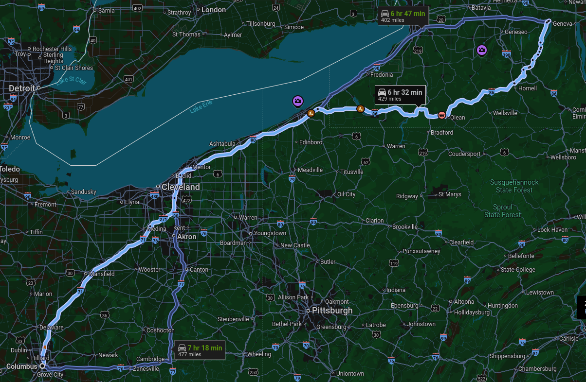
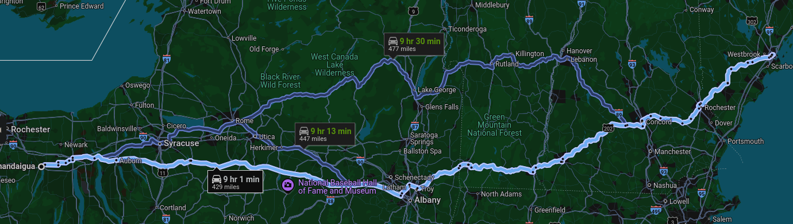

# Move to Maine
### [Whole Trip](https://maps.app.goo.gl/MdMXAQ76ksYJKyqo7)
35 hours, 2159 miles

[Day 1](#day-1) 
[Day 2](#day-2) 
[Day 3](#day-3) 
[Day 4](#day-4) 
[Day 5](#day-5) 
[Day 6 - 9](#day-6-9) 
[Day 10](#day-10) 

# Day 1  
### August 27th

Austin to [Little Rock, AR](https://maps.app.goo.gl/RSqsVbbEEius8Uhy6)

7 hours, 33 minutes (517 miles)

- Depart ~10 AM

- 2 Stops? +1 hour

- Arrive ~6:30 PM

- Stay at Hotel/Motel

# Day 2
### August 28th
Little Rock, AR to [Murfreesboro, TN](https://maps.app.goo.gl/bVtnWE2aw6Twp9RWA)

5 hours, 22 minutes (375 miles)

- Depart ~10 AM

- 1 Stop? +30 minutes

- Arrive ~4 PM

- Stay at Air BnB (TBD)

# Day 3
### August 29th
Stay in Murfreesboro to hang with family

# Day 4
### August 30st
Murfreesboro, TN to [Columbus, OH](https://maps.app.goo.gl/Q4yeC6588fyNRwJHA)

6 hours, 7 minutes (412 miles)

- Depart ~9 AM

- 2 Stops? +1 hour

- Arrive ~5:30 PM (Time Zone Change)

- Stay at Hotel/Motel

# Day 5
### August 31st

Columbus, OH to [Canandaigua, NY](https://maps.app.goo.gl/rc2MMeUWn7wRtm9f6)

6 hours, 32 minutes (429 miles)

- Depart ~10 AM

- 2 Stops? +1 hour 

- Arrive ~5:30 PM

- Stay at Air BnB (TBD)

# Day 6-9
### September 1st - 4th

Stay in Canandaigua to hang with family.

# Day 10
### September 5th

Canandaigua, NY to [Portland, ME](https://maps.app.goo.gl/X56vmV43XoPi2mTK6) 

 [117 Lofts](https://www.portproperty.com/building/117-preble-street/)

9 hours (429 miles)

- Depart ~8 AM

- 3 Stops? +1.5 hours

- Arrive ~6:30 PM